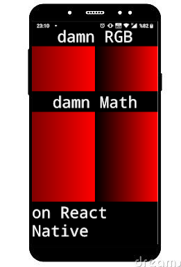

i use [**rgb-hex**](https://github.com/sindresorhus/rgb-hex) from **sindresorhus**.



This function get hex code of color what called with 3 number vars like: `rgbhex(255, 0 ,0)`

Used **<View>** component for each pixel. Pixel dimensions got from `Dimensions`: `Dimensions.get("window").width` 

For dynamic width size, used the below:

```javascript

   _increaseCompUp2Bigger = (biggerNumber, arrayedComponents) => {
       // if smaller the number of the bigger array then comp array, bigger number will be increase the def 320px
       if (biggerNumber < 320){
           biggerNumber = mininumWindowWidth
       }

       const arrayItemNumber = arrayedComponents.length

    for (let i = 0; i < biggerNumber; i++){
        let k = (i+1)/biggerNumber
        
        // corresponding item index number will be ceiled
        const corresArrayItemNumber = Math.ceil( arrayItemNumber*k)
        // convert array index number
        let realCorresArrayItemNumber = corresArrayItemNumber-1;
        // refuge to up zero
        if (realCorresArrayItemNumber < 0){ realCorresArrayItemNumber=0 }
        // get corresponding item for bigger numbered array
        const corresItem4allDimensedviews = arrayedComponents[realCorresArrayItemNumber]
        // push the new item into the allDimensedviews array
        allDimensedviews.push(corresItem4allDimensedviews)
    }

   }
```

for joining two component, used **<View>** component and `{variable}`:

```javascript
  _addComponent = (Componentt, ExpComponent) => {
       return (<View
       style = {{
           flexDirection: 'row'
       }}
       >
           {Componentt}
           {ExpComponent}           
           </View>
           );
   }

   _nullReturn = () => {
       return(<View></View>);
   }

   _joinComponents = (arrayedComponents) => {
    let Componentss = this._nullReturn()
    for (let i = 0; i < arrayedComponents.length; i++){
        Componentss = this._addComponent(Componentss, arrayedComponents[i]) // arrayedComponents[i] //
    }
    return (
        <View
        style = {{
            flexDirection: 'row'
        }}
        >
        {Componentss}
        </View>
    );
   }
```

Note that: this method is not fast. Just for *FUN*.